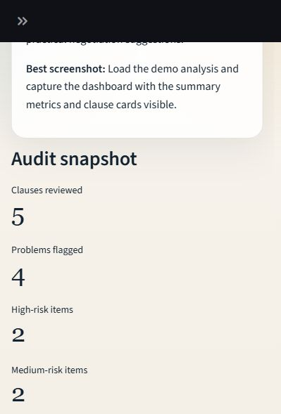
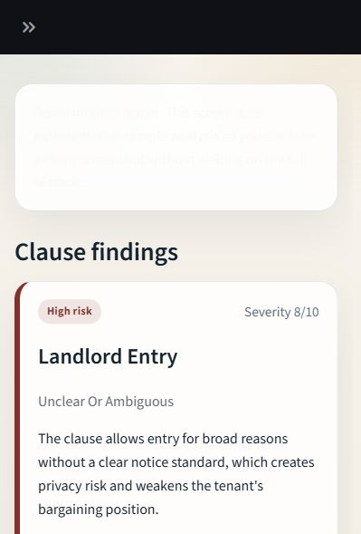

# LeaseGuard AI

Rental leases are long, jargon-heavy documents that can hide important legal and financial obligations. LeaseGuard AI is an AI-assisted lease review project built around that problem.

The project uses lease review as a focused domain for exploring retrieval-augmented generation, structured prompting, jurisdiction-aware legal context, evaluation workflows, and prompt iteration. The app presents the system through a renter-facing interface, while the broader goal is systems design: showing how an AI pipeline can move from raw lease text to grounded clause analysis, prioritized findings, and repeatable evaluation.

### Legal Disclaimer

LeaseGuard AI helps renters understand lease language and prepare informed questions before signing. Legal advice comes from a licensed attorney or qualified housing advocate.

## How It Works

LeaseGuard AI uses a four-part workflow:

1. **Input and retrieval**
   The system accepts lease text, cleans and structures the document, and retrieves relevant reference material through retrieval-augmented generation.

2. **Multi-stage AI analysis**
   A sequence of prompts reviews the lease against benchmark clauses, educational resources, and jurisdiction-specific legal context.

3. **Evaluation system**
   Agent outputs are compared against reference examples and reviewed for accuracy, usefulness, severity calibration, and clarity.

4. **Prompt iteration loop**
   Prompt variants are tested, scored, and promoted into the main pipeline when they improve analysis quality and consistency.

### 1. Input and Retrieval

The review process begins by collecting lease text from the user and preparing it for analysis. The system cleans and organizes the document so it can be reviewed clause by clause.

The backend uses retrieval-augmented generation so the analysis stays grounded in supporting material and benchmark examples. The knowledge base is organized into three collections:

- **Gold-standard leases**  
  Fair and balanced lease templates used as comparison benchmarks.

- **Real-world lease examples**  
  Examples of how similar clauses appear in actual rental agreements.

- **Lease information resources**  
  Educational documents about lease red flags, tenant protections, common problem clauses, and renter-facing guidance.

These resources are indexed with **LlamaIndex** and **ChromaDB** and retrieved during analysis. This structure allows the agent to compare contract language against ideal lease language, real-world examples, and explanatory tenant resources.

### 2. Multi-Stage AI Analysis

LeaseGuard AI uses a staged analysis pipeline, which makes the system easier to inspect, evaluate, and improve.

The pipeline includes four core steps:

1. **Define standards**  
   The system establishes a legal and contractual baseline for the renter's city and state using housing context and reference material.

2. **Analyze clauses**  
   Each lease clause is reviewed and labeled using categories such as `fair`, `unclear`, `unfair but legal`, or `illegal`. The system also assigns a severity score and explains the risk in plain English.

3. **Prioritize findings**  
   The system ranks issues by urgency so renters can focus on the clauses with the highest legal, financial, or practical impact.

4. **Generate report**  
   The final report summarizes the lease review, highlights key risks, recommends negotiation targets, includes educational notes, and cites supporting sources where available.

The analysis flow uses **LangChain** for orchestration and tool calling. Alongside retrieval tools, the system can pull jurisdiction-specific housing context from an allowlisted set of legal and public-interest websites. That allows the agent to combine lease text, benchmark examples, educational references, and local legal context in a single review workflow.

### 3. Evaluation System

A major part of this project is the evaluation workflow used to measure and improve output quality over time.

The repository includes a human-guided process for evaluating the lease-review pipeline:

1. **Build reference examples**  
   A comparison dataset is created from lease guidance documents, public legal resources, and known examples of common lease risks. These examples define what a strong output should identify, how risks should be explained, and how severe different findings should be.

2. **Evaluate outputs**  
   The agent's clause findings and final reports are scored against the reference examples and reviewed for factual accuracy, risk detection, severity calibration, clarity, and usefulness to renters.

3. **Review failure cases**  
   Weak outputs are inspected to identify recurring issues such as missed risks, vague explanations, overconfident legal language, or weak prioritization.

This evaluation layer matters because lease-review systems depend on consistency, careful wording, and calibrated risk assessment. The goal is a review that is grounded, understandable, and useful for decision-making.

### 4. Prompt Iteration Loop

The project includes a prompt-improvement workflow designed to make iteration faster and more disciplined.

Prompt variants are tested in a prompt lab using cached lease inputs and saved outputs. This makes experimentation cheaper and more repeatable than rerunning the full pipeline for every prompt change.

The workflow follows a simple loop:

1. Identify a weak output or recurring failure pattern.
2. Draft a prompt variant that targets the issue.
3. Run the variant against cached examples.
4. Compare the results against the baseline prompt.
5. Promote stronger prompts into the main analysis pipeline.

This loop moves the project beyond one-off prompt engineering and toward a more systematic AI development process.

## Frontend Implementation

The frontend is built in **Streamlit** and serves as the user-facing layer for the lease review pipeline. It makes the backend workflow easier to inspect: users can move through an audit flow, read cleaned lease text, review clause-level findings, and see the final improvement report.

The interface currently includes:

- a lease audit flow for running the review pipeline
- a "Read Your Lease" view with cleaned lease text and plain-language translation
- clause-level findings with severity labels and explanations
- a final improvement report with risks, negotiation targets, educational notes, and supporting context
- guidance for common lease terms and local tenant-support resources

The screenshots below show the two main frontend views.

### Audit Flow



### Lease Reading View



## Repository and Setup

### Repository Structure

- `frontend/`  
  Streamlit app and lightweight backend entrypoints for sample and live audit flows.

- `agent/`  
  Main lease-analysis pipeline, cached outputs, and ChromaDB-backed retrieval artifacts.

- `rag_data/`  
  Source materials used to build the retrieval collections.

- `evaluation/`  
  Reference-example generation, output evaluation, prompt testing, and evaluation reporting.

### Running the Project

#### Sample Mode

```powershell
python -m pip install -r frontend/requirements.txt
python -m streamlit run frontend/streamlit_app.py
```

Sample mode runs the app with prepared lease examples and cached analysis artifacts.

#### Live Audit Mode

Live audit mode runs the lease-analysis pipeline against new lease input and retrieves supporting context from the indexed reference collections.

Before running live mode, make sure the required environment variables, retrieval indexes, and backend dependencies are configured.
